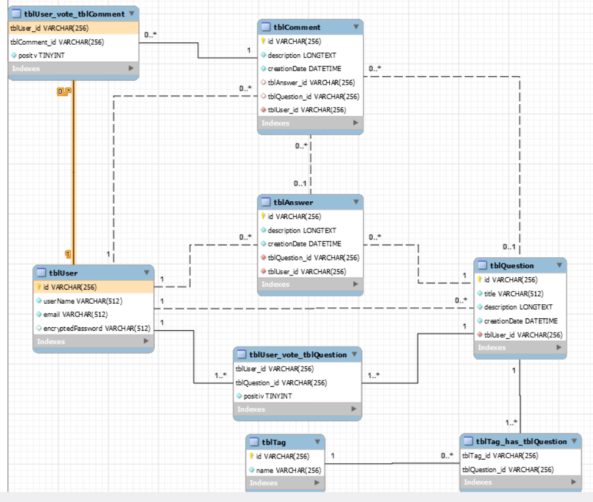

# AMT_Project

## Features working

- Sign up / login
- Create question
- Comment/Answer
- Browse and filter questions
- My profile view and edit

## Features not working

- JMeter load tests are missing
- Upvote and down vote
- Add tags to a question

## Get Started

This project is dependant to our [REST API project](https://github.com/amtteamheig/amt_project_api). Before launging this project, run the REST API first and retreive the API key after running the `populate-api.sh` and past the key in the file `src/main/resources/META-INF/microprofile-config.properties` under the propertie `apikey`.

Don't forget to set the correct link to the API, `localhost` if you're running with `mvn liberty:dev` or `gamification-container` if you're using docker. You can set this value in the file`src/main/resources/META-INF/microprofile-config.properties` .

To get started and launch the database and the web app, run the command `./run-app.sh`. This will start both entities in seperate docker container.

## Access to the database

To get access to the database, you need to follow those steps : 

1. Connect to the mysql container: 
`docker exec -it help2000_db_container mysql -u dbDevHelp2000 -p`
2. Enter the root password : `devpass`
3. Enter the app's database by typing : `mysql> USE help2000`
4. Now you can display all tables with the command : `show tables;`

### DB schema



## How to automate the docker deployment

- Build the image with the script `build-image.sh`
- You can access to the site at the port `http://localhost:9000/home`

## Package structure

```
src/
└── main
    ├── java
    │   └── ch
    │       └── heigvd
    │           └── amt
    │               └── mvcProject
    │                   ├── application
    │                   │   └── user
    │                   ├── domain
    │                   │   └── user
    │                   ├── infrastructure
    │                   │   └── persistence
    │                   │       └── memory
    │                   └── ui
    │                       └── web
    │                           └── user
    │                               └── handler
    └── webapp
        ├── assets
        │   ├── css
        │   ├── imgs
        │   └── js
        └── WEB-INF
            └── views
                └── fragments

```

- `application` : All class that describe how the user can interact with the
 domain
- `domain` : Business object, can not interect with outside => Independent !
- `insfratructure`
    - `persistence` : The connection with the data
- `ui` : Interaction with the UI
    - `web` : servlet, dependance, framework

## Downloading the package
The package can be downloaded from the organisation's packages, since the organisation is private you need to ask for privileges to one of the administrators. Then you can run this command with docker to get the container : `docker pull ghcr.io/amtteamheig/amt_project:latest`

